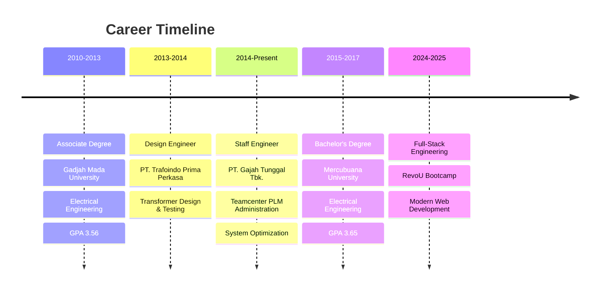

#  Hi there, I'm Rizky Amanda!

<div align="center">
  
  <!-- Animated Header -->
  
  
  <!-- Typing Animation -->
  
  
  <!-- Profile Views Counter with Animation -->
  
  
</div>

<!-- Animated Divider -->


##  About Me


```javascript
const rizkyAmanda = {
    pronouns: "She/Her",
    location: "Tangerang, Indonesia 🇮🇩",
    currentRole: "Staff Engineer @ PT. Gajah Tunggal Tbk.",
    education: "Full-Stack Software Engineering @ RevoU",
    
    challenges: [
        "Building scalable web applications",
        "Optimizing system performance",
        "Creating intuitive user experiences"
    ],
    
    achievements: {
        systemOptimization: "30% performance boost",
        workflowAutomation: "40% manual task reduction", 
        processingSpeed: "4x faster with VBA automation",
        experience: "10+ years in engineering"
    },
    
    currentFocus: "Mastering React, Next.js & Cloud Technologies",
    funFact: "I love turning complex problems into elegant solutions! ✨"
};
```

<div align="center">
  
  <!-- Animated Skills Icons -->
  
  
</div>

<!-- Animated Line -->


##  Tech Stack & Skills

<div align="center">

### 💻 Programming Languages


### 🎨 Frontend Development


### ⚙️ Backend & Database


### 🛠️ Tools & Infrastructure


</div>

<!-- Animated Wave Divider -->


##  GitHub Analytics

<div align="center">
  
  <!-- Animated Stats Cards -->
  
  
  
</div>

<div align="center">
  
  <!-- GitHub Streak Stats -->
  
  
</div>

<!-- Activity Graph -->
<div align="center">
  
</div>

### 📊 Real-time Language Usage

<div align="center">
  
  <!-- Animated Language Stats -->
  
  
  <!-- Language Percentage with Progress Bars -->
  
  **JavaScript** 
  
  
  **TypeScript** 
  
  
  **Python** 
  
  
  **CSS** 
  
  
  **HTML** 
  
  
</div>

<!-- Animated Divider -->


##  Key Achievements

<div align="center">

| 🎯 Achievement | 📊 Impact | 🛠️ Technology |
|:---:|:---:|:---:|
| **System Performance** | ⚡ +30% Boost | Teamcenter PLM, React |
| **Workflow Automation** | 🔄 -40% Manual Tasks | Python, JavaScript |
| **Processing Speed** | 🚀 4x Faster | VBA, Excel Automation |
| **Engineering Experience** | 💼 10+ Years | Full-Stack Development |

</div>

<!-- Trophies -->
<div align="center">
  
</div>

##  Featured Projects

<div align="center">

<!-- Project Cards -->
<table>
<tr>
<td width="50%">

### 🏢 Fleet Database Management
**A modern fleet management solution**


🔹 Responsive frontend interface  
🔹 Real-time data rendering  
🔹 Intuitive user experience  
🔹 API integration & optimization  

</td>
<td width="50%">

### 🛒 Global Green E-Commerce
**Organic food marketplace platform**


🔹 Complete e-commerce solution  
🔹 Product catalog & cart system  
🔹 Organic-themed UI design  
🔹 Performance optimized  

</td>
</tr>
<tr>
<td width="50%">

### 📊 Excel Automation System
**VBA-powered productivity booster**


🔹 4x processing speed increase  
🔹 Automated job order management  
🔹 Eliminated manual data entry  
🔹 Macro-based workflow optimization  

</td>
<td width="50%">

### 🏠 Smart Home IoT System
**RFID & Arduino integration project**


🔹 RFID access control system  
🔹 Arduino Mega 2560 based  
🔹 SMS integration & alerts  
🔹 IoT device communication  

</td>
</tr>
</table>

</div>

<!-- Animated Snake -->
<div align="center">
  
</div>

##  Professional Journey

<div align="center">



</div>

##  Let's Connect & Collaborate!

<div align="center">
  
  <!-- 3D Social Links -->
  <a href="https://www.linkedin.com/in/rizky-amanda">
    
  </a>
  <a href="https://github.com/amandzaa">
    
  </a>
  <a href="mailto:amandarizkyky@gmail.com">
    
  </a>
  <a href="https://wa.me/+6285774441992">
    
  </a>
  
  <br><br>
  
  <!-- Animated Contact Me Button -->
  <a href="mailto:amandarizkyky@gmail.com">
    
  </a>
  
</div>

##  Current Objectives

<div align="center">

| 🎯 Goal | 📈 Progress | 🎪 Status |
|:---|:---:|:---:|
| Master React & Next.js |  | 🔥 Active |
| Learn Cloud Technologies |  | 📚 Learning |
| Contribute to Open Source |  | 🌱 Growing |
| Build Full-Stack Apps |  | 🚀 Building |

</div>

<!-- Quote Section -->
<div align="center">
  
  
  
</div>

<!-- Animated Footer -->


<div align="center">
  
  **💡 "Turning complex problems into elegant solutions, one commit at a time!" 💡**
  
  <!-- Animated Visitor Badge -->
  
  
  <!-- GitHub Follow Button -->
  [](https://github.com/amandzaa)
  
  <br>
  
  <!-- Animated Stars -->
  ⭐ **If you find my work interesting, don't forget to star my repositories!** ⭐
  
</div>

<!-- Hidden Animated Elements -->


---

<div align="center">
  
  
  
</div>
